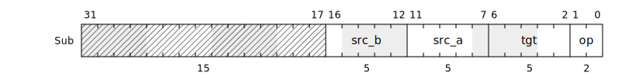

# Packtype


Packtype is a Python framework for describing packed data structures for use in low-level hardware design, verification, and firmware development. From this single specification, equivalent implementations for different languages can be generated (for example SystemVerilog).

## Installation

The easiest way to install Packtype is to use PyPI:

```
$> python3 -m pip install packtype
```

Alternatively, you can install the latest version directly from this repository:

```
$> python3 -m pip install git+https://github.com/Intuity/packtype
```

## Using Packtype

Packtype provides the `packtype` command line utility which can be used in
conjuction with a specification (detailed below) to generate different types of
outputs.

### Rendering Code

A Packtype specification can be rendered into another programming language, for
example SystemVerilog:

```bash
# Render SystemVerilog version of the specification
#  python -m packtype <SPEC>          code <LANG> <OUTDIR>
$> python -m packtype examples/structs/spec.py code sv ./output_dir
```

The positional arguments are:

 * `SPEC` - path to the Packtype specification file to process;
 * `code` - command to Packtype to render specification to code;
 * `LANG` - language to render (`sv` selects SystemVerilog);
 * `OUTDIR` - path to the output directory to write rendered files.

Then options are available to modify the behaviour:

 * `--debug` - generate debug messages as the tool runs.
 * `--help` - show the help prompt.

### Rendering SVG

A Packtype `struct` can also be rendered to an SVG using the `svg` command:

```bash
# Render an SVG version of a struct
#  python3 -m packtype <SPEC>                 svg <STRUCT>      <OUTPUT>
$> python3 -m packtype examples/union/spec.py svg Encodings.Sub test.svg
```

The positional arguments are:

 * `SPEC` - path to the Packtype specification file to render;
 * `svg` - command to Packtype to render specification to an SVG;
 * `STRUCT` - hierarchy of the structure to render (e.g. `<PACKAGE>.<STRUCT>`);
 * `OUTPUT` - file to write the SVG to, if omitted it will print the output to
   STDOUT.



## Examples

A number of examples are provided in the `examples` folder - each of these can be run by executing the `test.sh` file within the directory.

## Packtype Specifications

Packtype specifications use a decorators and classes to declare the different data structures. Once a specification has been written, the Packtype utility can be used to generate code for different languages.

### Package Declaration

Packages are signified using the ``@packtype.package()`` decorator, this declares
a root object onto which constants, typedefs, enums, structs, and unions can be
bound.

```python
import packtype

@packtype.package()
class SomeProtocolPkg:
    """Contains definitions for some protocol"""
    ...
```

### Constants

Numeric constants can be attached to the root of a package to share fixed values between different parts of implementation, verification, and firmware.

```python
import packtype
from packtype import Constant

@packtype.package()
class SomeProtocolPkg:
    """Contains definitions for some protocol"""
    ADDRESS_WIDTH : Constant = 16
    DATA_WIDTH    : Constant = 32
    SIZE_WIDTH    : Constant = 8
```

### Typedefs

Simple bitvector types can be declared within a package using the `Scalar` type,
the parameterisation determines the bit-width of the structure:

```python
import packtype
from packtype import Constant, Scalar

@packtype.package()
class SomeProtocolPkg:
    """Contains definitions for some protocol"""
    # Constants
    ADDRESS_WIDTH : Constant = 16
    # Simple Types
    Address : Scalar[ADDRESS_WIDTH]
```

### Enumerations

Enumerations are declared using the `@<PKG>.enum()` decorator and can accept the
following two attributes:

 * `width` - sets a fixed bit-width of the enumeration, this must be a positive integer;
 * `mode` - sets how entries of the enumeration are assigned values, the supported modes are:

   * `EnumMode.INDEXED` - Each value increments by one, starting at zero.
   * `EnumMode.ONE_HOT` - Each value sets exactly one bit position high (e.g. `1`, `2`, `4`, `8`).
   * `EnumMode.GRAY` - Values form a Gray code where only one bit flips between any two consecutive values.

Enumerations can either be declared with explicit or automatically incrementing
values, or a mix of the two.

```python
import packtype
from packtype import EnumMode

@packtype.package()
class DecoderPkg:
    ...

@DecoderPkg.enum(width=12)
class MessageType:
    """ Different message types with explicit values """
    PINGPONG : Constant = 0x123
    SHUTDOWN : Constant = 0x439
    POWERUP  : Constant = 0x752

@DecoderPkg.enum(mode=Enum.GRAY)
class DecoderState:
    """ Gray-coded states of the decoder FSM """
    DISABLED : Constant
    IDLE     : Constant
    HEADER   : Constant
    PAYLOAD  : Constant
```

### Structs

Structs are declared using the `@<PKG>.struct()` decorator and can contain any
number of fields that are simple scalar values, enumerations, or nested structs
or unions. The decorator supports the following attributes:

 * `width` - sets a fixed bit-width of the struct, this must be a positive integer;
 * `packing` - determines the order in which declared fields are placed in the packed version:
    * `Packing.FROM_LSB` - place fields starting at the least-significant bit;
    * `Packing.FROM_MSB` - place fields starting from the most-significant bit.

```python
import packtype
from packtype import Scalar

@packtype.package()
class DecoderPkg:
    ...

@DecoderPkg.struct(width=32)
class MessageHeader:
    """ Common header for all messages """
    target_id : Scalar[8]
    msg_type  : MessageType

@DecoderPkg.struct() # Width calculated from field sizes
class PingPongPayload:
    """ Payload of a ping-pong keepalive message """
    source_id  : Scalar[ 8]
    is_pong    : Scalar[ 1]
    ping_value : Scalar[15]
    timestamp  : Scalar[ 8]

@DecoderPkg.struct()
class PingPongMessage:
    """ Full message including header and payload """
    header  : MessageHeader
    payload : PingPongPayload
```

By default, fields are packed into data structures from the LSB - but this can be reversed to pack from the MSB by providing the `packing=Packing.FROM_MSB` argument to the decorator. For example:

```python
import packtype
from packtype import Packing, Scalar

@packtype.package()
class DecoderPkg:
    ...

@DecoderPkg.struct(packing=Packing.FROM_MSB, width=32)
class PingPongPayload:
    """ Payload of a ping-pong keepalive message """
    source_id  : Scalar[ 8]
    is_pong    : Scalar[ 1]
    ping_value : Scalar[15]
    timestamp  : Scalar[ 8]
```

You can also render using Jupyter notebooks, see [example.ipynb](example.ipynb) as an example

### Unions

Unions allow different data structures to form different projections over the same raw bits - this is especially useful in protocol decoders where a bus may carry different formats and structures of data in different cycles. All components of a union must be of the same size, otherwise the tool will raise an error.

```python
import packtype
from packtype import Scalar

@packtype.package()
class DecoderPkg:
    ...

@DecoderPkg.union()
class MessageBus:
    """ Union of the different message phases of the bus """
    raw       : Scalar[32]
    header    : MessageHeader
    ping_pong : PingPongPayload
```

### Profiling

Using Packtype objects within a testbench can cause significant overhead if many
pack and unpack operations are being performed. To help diagnose performance
issues, you can enable profiling which counts the number of each type of object
that are created during a run:

```python
from packtype.base import Base

def my_test_function():
    Base._pt_enable_profiling(limit=10)
```

The `limit` keyword will filter out any objects from the report that have less
than this number of creations by the end of the run, this can be useful to
filter out noise of many small unique objects.
